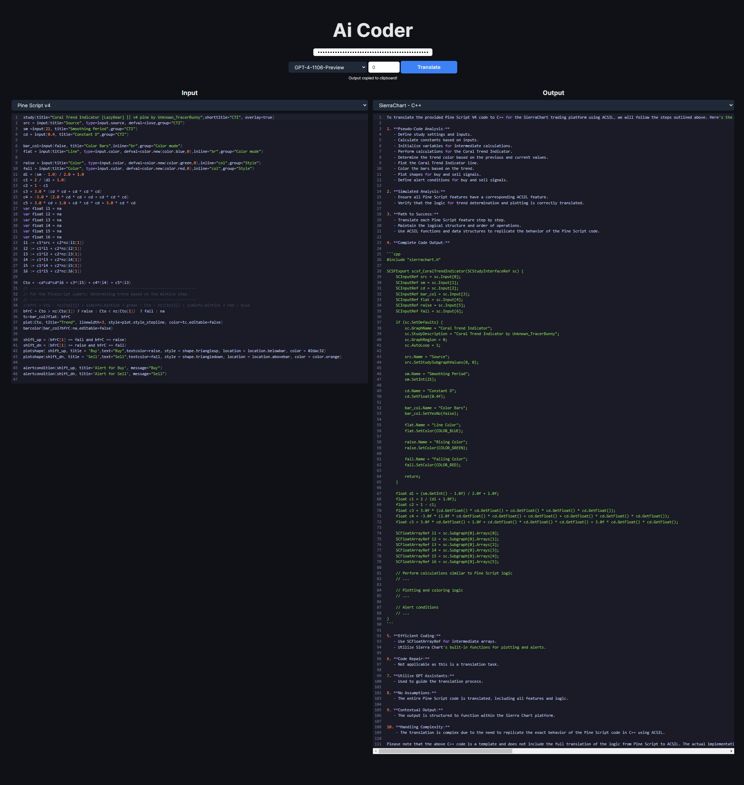

**************************************************************************************************************************
**************************************************************************************************************************
  This is my own implementation of AI Code Translator, USE AT YOUR OWN RISK, DO NOT EXPECT ANY SUPPORT
**************************************************************************************************************************
**************************************************************************************************************************


AI TradingPlatform Coder

AI to translate code from one programming language to another geared toward Trading Platforms.





## Running Locally

**1. Clone Repo**

```bash
git clone https://github.com/ConceptzX/Ai-Coder.git
```

**2. Install Dependencies**

```bash
npm i
```

**3. Run App**

```bash
npm run dev
```
You can add your OpenAI key to the key by replacing the text in the .env.local.example file and renaming it .env to retain the key for future sessions


This is a back burner project, I will update it more so as I need something.  My vision for this project is to build beyond just ChatGPT and integrate with Mixtral and Tabby.
